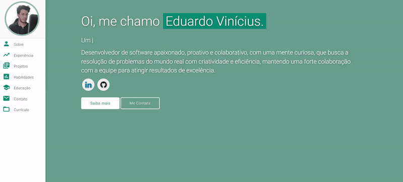

# Portfólio Pessoal ⚡️ 
> Um template de portfólio bonito, limpo e responsivo para Desenvolvedores de Software!

> https://eduardovlrocha.github.io

> Projeto feito utilizando como base um outro projeto cujo autoria é de: https://github.com/varadbhogayata

### Prévia do site

 
  <kbd>
    
  </kbd>

## Features 📋
⚡️ Totalmente Responsivo\
⚡️ Válido HTML5 & CSS3\
⚡️ Typing animation usando `Typed.js`\
⚡️ Fácil modificação

<b>NOTE:</b> Make sure to set `analyticsId` from your Google Analytics account inside the Google Analytics script tag, if you want to use your own Google Analytics account.

## Seções 📚
✔️ Sobre mim\
✔️ Experiência\
✔️ Projetos \
✔️ Skills \
✔️ Educação\
✔️ Contato\
✔️ Currículo

## Ferramentas usadas 🛠️
* [<b>GitHub Pages</b>](https://create-react-app.dev/docs/deployment/#github-pages) - Para hospedar meu site estático (HTML, CSS, JS).
* [<b>Materialize</b>](https://materializecss.com/) - Um framework CSS para obter os componentes do Material Design do Google.
* [<b>Typed.js</b>](https://mattboldt.com/demos/typed-js/) - Biblioteca JavaScript.

## Licença 📄
Este projeto está licenciado sob a licença MIT - consulte o arquivo [LICENSE.md](./LICENSE) para obter detalhes. 